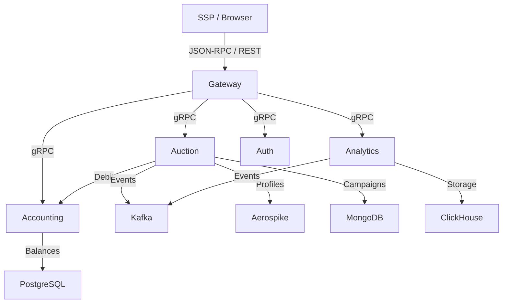

# RTB Platform / RTB Платформа

**🇬🇧** High‑load Real‑Time Bidding (RTB) platform with analytics subsystem and dashboard.  
**🇷🇺** Высоконагруженная система проведения рекламных аукционов в реальном времени (Real‑Time Bidding) с аналитической подсистемой и дашбордом.

The platform accepts ad display requests, runs an auction among advertising campaigns, debits the winner’s budget, and collects detailed statistics. All components run in Docker containers and communicate via gRPC and Kafka.  
Платформа принимает запросы на показ рекламы, проводит аукцион среди рекламных кампаний, списывает бюджет победителя и собирает детальную статистику. Все компоненты работают в Docker-контейнерах и взаимодействуют по gRPC и Kafka.

---

## 🇬🇧 Architecture / 🇷🇺 Архитектура

### 🇬🇧 Core Services / 🇷🇺 Основные сервисы

- **Gateway** – single entry point for external clients. Accepts JSON‑RPC (auction, debit) and REST (analytics, Excel export). Serves the SPA dashboard. Includes rate‑limiting, idempotency, authentication (JWT).  
  **Gateway** – единая точка входа для внешних клиентов. Принимает JSON‑RPC (аукцион, списание) и REST (аналитика, экспорт Excel). Раздаёт SPA‑дашборд. Включает rate‑limiting, идемпотентность, аутентификацию (JWT).

- **Auction** – RTB core. Performs first‑price auction with LSD Radix Sort (O(N)), geo‑targeting, LTV scoring, A/B experiments. Asynchronously processes bids via `timedcache`.  
  **Auction** – ядро RTB. Выполняет аукцион первой цены с Radix Sort LSD (O(N)), учитывает гео‑таргетинг, LTV, A/B‑эксперименты. Асинхронно обрабатывает запросы через `timedcache`.

- **Accounting** – financial service. Stores campaign balances (PostgreSQL), provides `Debit` and `GetBalance` methods with idempotency.  
  **Accounting** – финансовый сервис. Хранит балансы кампаний (PostgreSQL), предоставляет методы `Debit` и `GetBalance` с идемпотентностью.

- **Analytics** – collects and analyses events. Generates reports, forecasts (Holt‑Winters), factor analysis (PCA). Events are consumed from Kafka and stored in ClickHouse.  
  **Analytics** – сбор и анализ событий. Генерирует отчёты, прогнозы (Хольт‑Уинтерс), факторный анализ (PCA). События поступают через Kafka и сохраняются в ClickHouse.

- **Auth** – authentication service. Registration, login, JWT issue and validation.  
  **Auth** – сервис аутентификации. Регистрация, логин, выпуск и валидация JWT‑токенов.

### 🇬🇧 Infrastructure / 🇷🇺 Инфраструктура

| Component   | Purpose                                      |
|------------|-------------------------------------------------|
| PostgreSQL | Accounting balances                            |
| ClickHouse | Analytics events                               |
| MongoDB    | Advertising campaigns                          |
| Aerospike  | User profiles (in‑memory, <1.5 ms)             |
| Kafka      | Asynchronous event bus between Auction and Analytics |
| Docker     | Containerisation of all services and databases   |

---

## 🇬🇧 Quick Start / 🇷🇺 Быстрый старт

Launch instructions: [launch.md](launch.md)  
Инструкция по запуску: [launch.md](launch.md)

## 🇬🇧 Documentation / 🇷🇺 Документация

- [Navigation / Навигация](docs/navigation.md)
- Service specifications / Спецификации сервисов: [docs/specification/](docs/specification/)
- Feature specifications / Технические задания: [docs/srs/](docs/srs/)

## 🇬🇧 Tech Stack / 🇷🇺 Стек технологий

**Backend**: Go 1.25, gRPC, Protocol Buffers, Kafka, Aerospike, MongoDB, PostgreSQL, ClickHouse.  
**Frontend**: React, TypeScript, Vite, Tailwind CSS, Recharts.  
**DevOps**: Docker, Docker Compose, Git.