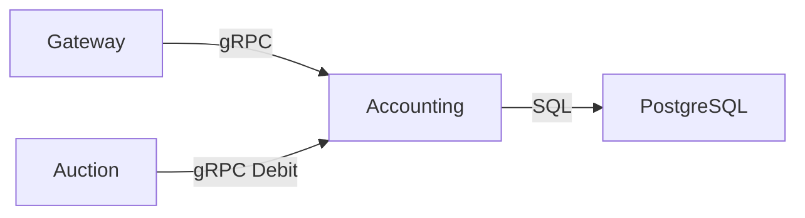
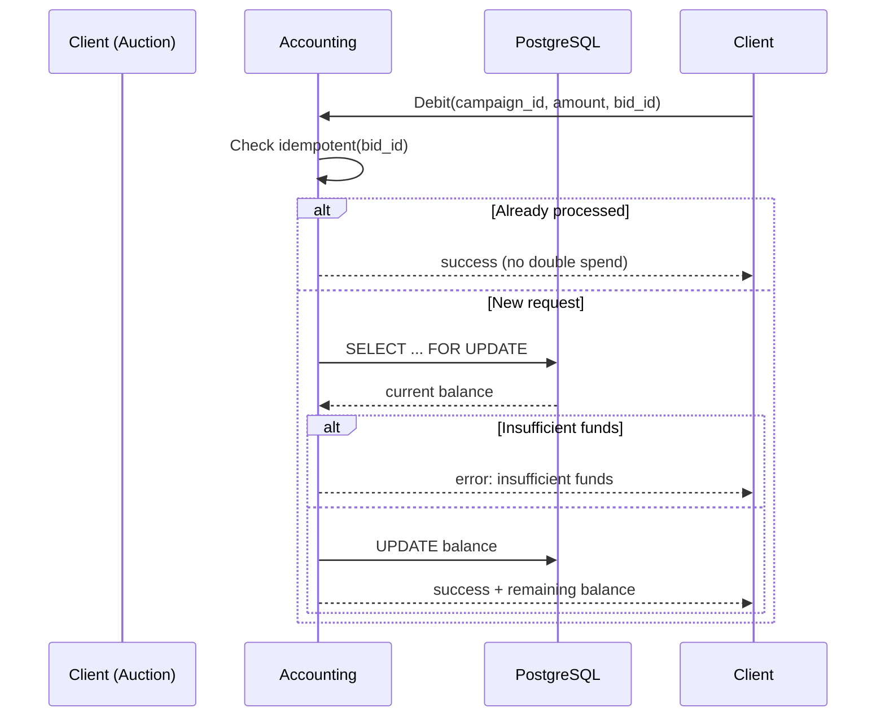
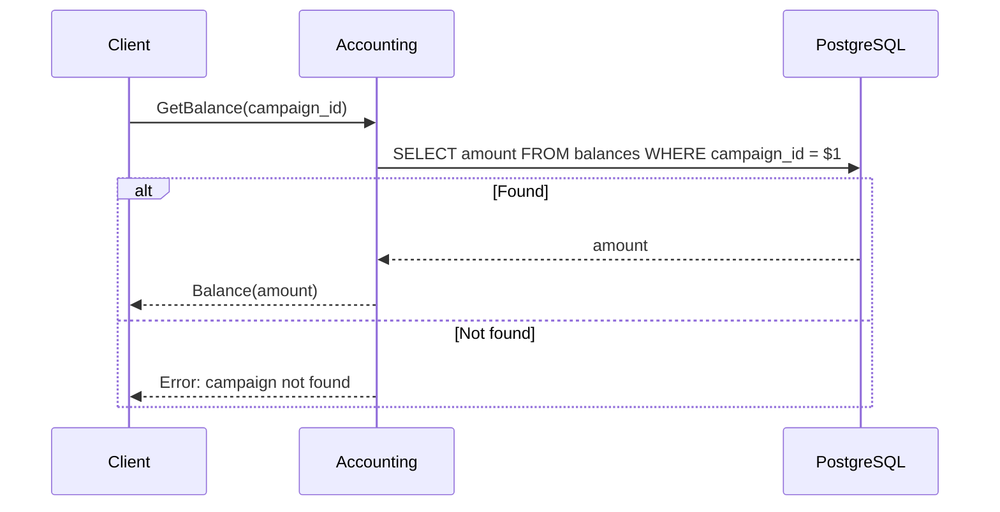
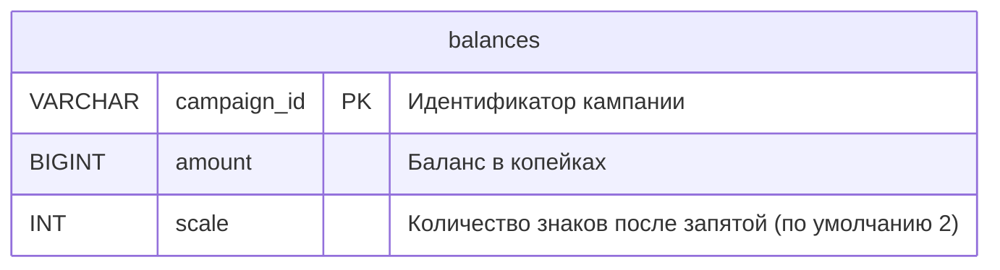

# 🇬🇧 Accounting Service / 🇷🇺 Сервис Accounting

## 🇬🇧 Overview / 🇷🇺 Обзор

Accounting is the financial service of the platform. It stores campaign balances, provides `Debit` and `GetBalance` gRPC methods, and guarantees idempotency so that the same bid is never charged twice.
Accounting — финансовый сервис платформы. Он хранит балансы кампаний, предоставляет gRPC‑методы `Debit` и `GetBalance` и гарантирует идемпотентность, чтобы одна и та же ставка никогда не списывалась дважды.

## 🇬🇧 Architecture / 🇷🇺 Архитектура

Accounting is called by Gateway (for manual balance checks) and by Auction (after a winner is determined). All monetary operations happen inside the service, using the `fixedpoint` package.
Accounting вызывается Gateway (для ручной проверки баланса) и Auction (после определения победителя). Все денежные операции выполняются внутри сервиса с использованием пакета `fixedpoint`.

## 🇬🇧 Request Flow / 🇷🇺 Поток запроса

### Debit (with idempotency)

### GetBalance

## 🇬🇧 Internal Structure / 🇷🇺 Внутреннее устройство

### `cmd/main.go`
Loads configuration, chooses storage (PostgreSQL with fallback to in‑memory), initialises test balances, and starts the gRPC server.
Загружает конфигурацию, выбирает хранилище (PostgreSQL с fallback на in‑memory), инициализирует тестовые балансы и запускает gRPC‑сервер.

### `internal/domain/account.go`
Defines the `BalanceStore` interface (`Get`, `Debit`, `Set`) and its in‑memory implementation for development without PostgreSQL.
Определяет интерфейс `BalanceStore` (`Get`, `Debit`, `Set`) и его in‑memory реализацию для разработки без PostgreSQL.

### `internal/domain/service.go`
Business‑logic layer: wraps the store with idempotency checks. The `Debit` method first verifies the `bid_id`, and only if it is new delegates to the store.
Слой бизнес‑логики: оборачивает хранилище проверками идемпотентности. Метод `Debit` сначала проверяет `bid_id`, и только если он новый, обращается к хранилищу.

### `internal/adapters/postgres/balance_store.go`
Production implementation of `BalanceStore` backed by PostgreSQL. Uses a stored function `debit_balance` for atomic debit operations.
Production‑реализация `BalanceStore` на базе PostgreSQL. Использует хранимую функцию `debit_balance` для атомарного списания средств.

### `internal/server/grpc.go`
Implements `AccountingServiceServer`. Converts protobuf messages to domain calls, handles errors, and returns proper gRPC status codes.
Реализует `AccountingServiceServer`. Преобразует protobuf‑сообщения в вызовы домена, обрабатывает ошибки и возвращает соответствующие gRPC‑статусы.

## 🇬🇧 Used Shared Packages / 🇷🇺 Используемые общие пакеты

| Package | Purpose |
|---------|---------|
| `config` | Load YAML and override with environment variables |
| `logger` | Structured logging with `slog` |
| `metrics` | OpenTelemetry counters and histograms |
| `shutdown` | Graceful stop with priorities and timeouts |
| `fixedpoint` | Exact monetary arithmetic (int64 kopeks) |
| `idempotent` | Idempotency key store (backed by `timedcache`) |

## 🇬🇧 Configuration / 🇷🇺 Конфигурация

Accounting is configured via YAML (`configs/dev.yaml`) and environment variables with the `RTB_` prefix.
Accounting настраивается через YAML (`configs/dev.yaml`) и переменные окружения с префиксом `RTB_`.

Key settings:
- `server.port` / `SERVER_PORT` – gRPC port (default `9002`)
- `database.dsn` / `DATABASE_DSN` – PostgreSQL connection string (empty → in‑memory store)
- `idempotency.ttl` / `IDEMPOTENCY_TTL` – lifetime of an idempotency key (e.g. `5m`)

## 🇬🇧 Database Schema / 🇷🇺 Схема базы данных

The `balances` table is the only persistent storage. It holds the current balance of each campaign in minimal currency units (kopeks). The table is automatically created at service startup.
Таблица `balances` — единственное постоянное хранилище. Она содержит текущий баланс каждой кампании в минимальных денежных единицах (копейках). Таблица создаётся автоматически при запуске сервиса.

- **campaign_id** – unique identifier of the advertising campaign.
- **amount** – balance in minimal units (e.g., kopeks for RUB, cents for USD).
- **scale** – number of decimal places (default 2), used for display purposes.

Atomic debit operations are performed by the `debit_balance` stored function, which locks the row (`SELECT ... FOR UPDATE`), checks funds, updates the balance, and returns the result. This function is created automatically if it does not already exist.
Атомарные операции списания выполняются хранимой функцией `debit_balance`, которая блокирует строку (`SELECT ... FOR UPDATE`), проверяет достаточно ли средств, обновляет баланс и возвращает результат. Функция создаётся автоматически, если её ещё нет.