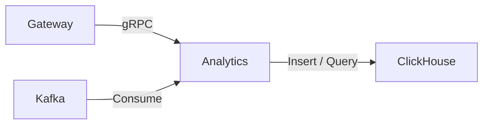
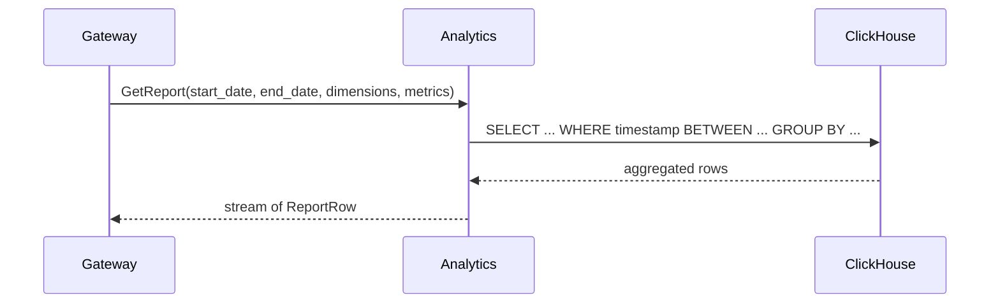
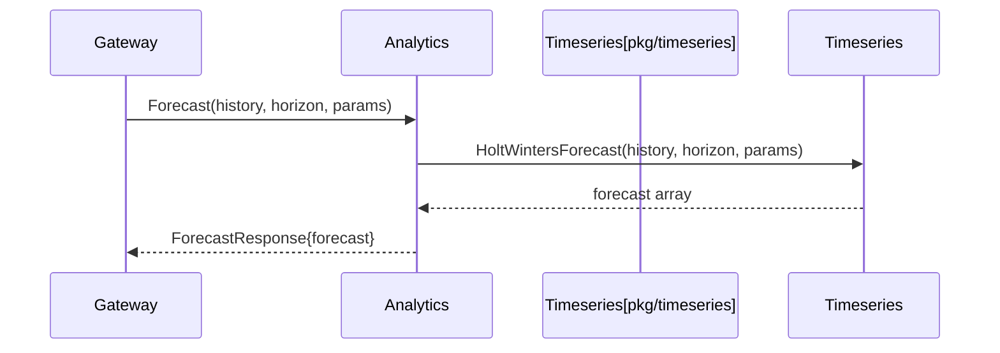
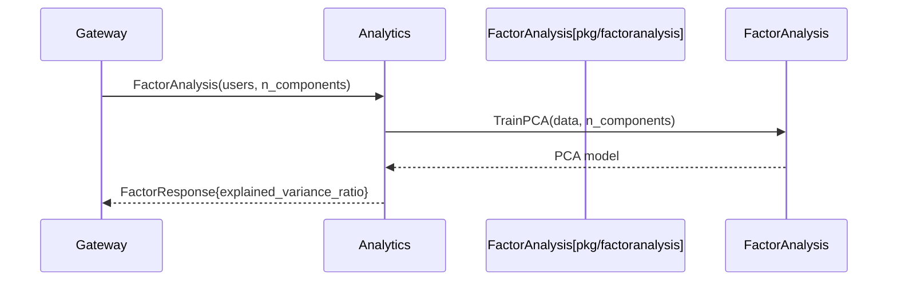
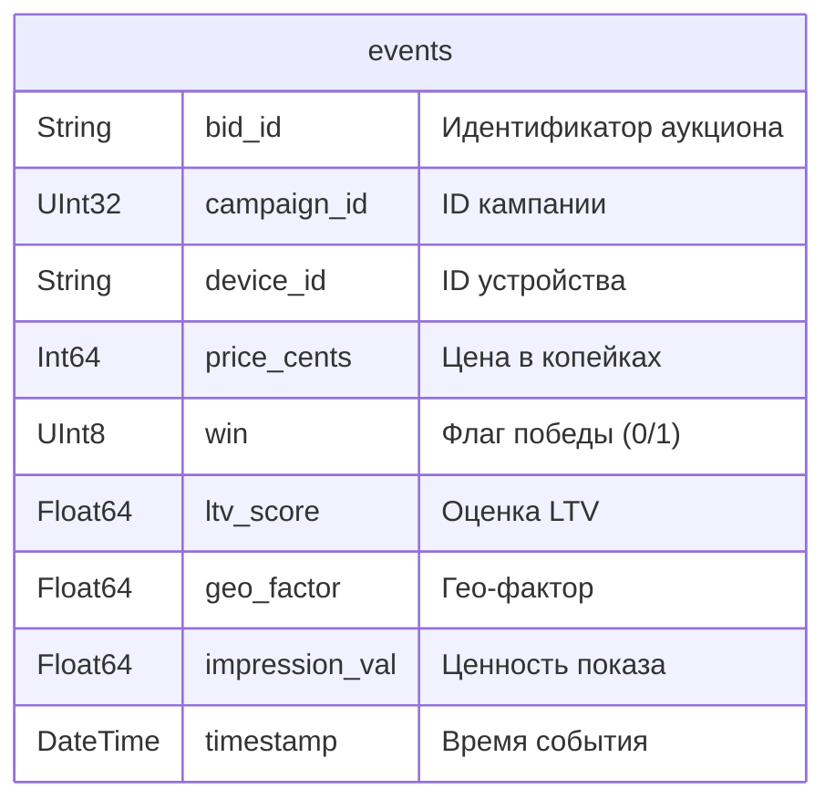

# 🇬🇧 Analytics Service / 🇷🇺 Сервис Analytics

## 🇬🇧 Overview / 🇷🇺 Обзор

The Analytics service collects auction events, stores them in ClickHouse, and provides reporting, forecasting, and factor analysis capabilities. It consumes events from Kafka (or directly from in‑memory store during development) and exposes a gRPC API that the Gateway uses to serve the dashboard.
Сервис Analytics собирает события аукционов, сохраняет их в ClickHouse и предоставляет возможности отчётности, прогнозирования и факторного анализа. Он потребляет события из Kafka (или напрямую из in‑memory хранилища во время разработки) и предоставляет gRPC API, которое Gateway использует для обслуживания дашборда.

## 🇬🇧 Architecture / 🇷🇺 Архитектура

Gateway calls Analytics for reports, forecasts, and factor analysis. Analytics reads raw events from Kafka and persists them in ClickHouse for fast analytical queries.
Gateway вызывает Analytics для получения отчётов, прогнозов и факторного анализа. Analytics читает сырые события из Kafka и сохраняет их в ClickHouse для быстрых аналитических запросов.

## 🇬🇧 Request Flow / 🇷🇺 Поток запроса

### GetReport

The report is generated directly from ClickHouse using an aggregated SQL query, then streamed back to the client as protobuf messages.
Отчёт формируется непосредственно в ClickHouse с помощью агрегирующего SQL‑запроса, затем стримится клиенту в виде protobuf‑сообщений.

### Forecast

Forecasting uses the Holt‑Winters implementation from `pkg/timeseries`. Default parameters (α=0.5, β=0.3, γ=0.2, period=4) are applied when not specified.
Прогнозирование использует реализацию Хольт‑Уинтерса из `pkg/timeseries`. Параметры по умолчанию (α=0.5, β=0.3, γ=0.2, period=4) применяются, если они не указаны.

### FactorAnalysis

Factor analysis uses PCA from `pkg/factoranalysis`. The client sends a set of user profiles, and the service returns the explained variance ratio for each principal component.
Факторный анализ использует PCA из `pkg/factoranalysis`. Клиент отправляет набор профилей пользователей, а сервис возвращает долю объяснённой дисперсии для каждой главной компоненты.

## 🇬🇧 Internal Structure / 🇷🇺 Внутреннее устройство

### `cmd/main.go`
Loads configuration, initialises the event store (ClickHouse with fallback to in‑memory), optionally starts a Kafka consumer, creates domain services (ReportService, ForecastService, FactorService), and launches the gRPC server.
Загружает конфигурацию, инициализирует хранилище событий (ClickHouse с fallback на in‑memory), опционально запускает Kafka‑потребитель, создаёт доменные сервисы (ReportService, ForecastService, FactorService) и запускает gRPC‑сервер.

### `internal/domain/event.go`
Defines the `Event` struct – a single auction outcome that is stored and analysed.
Определяет структуру `Event` – единичный исход аукциона, который сохраняется и анализируется.

### `internal/domain/report.go`
Contains `EventStore` interface and `ReportService`. The report service aggregates events by dimensions (campaign, device) and computes metrics (impressions, clicks, spend).
Содержит интерфейс `EventStore` и `ReportService`. Сервис отчётов агрегирует события по измерениям (кампания, устройство) и вычисляет метрики (показы, клики, расходы).

### `internal/domain/forecast.go`
Wraps `pkg/timeseries.HoltWintersForecast` with sensible defaults.
Оборачивает `pkg/timeseries.HoltWintersForecast` с разумными значениями по умолчанию.

### `internal/domain/factor_analysis.go`
Wraps `pkg/factoranalysis.TrainPCA`.
Оборачивает `pkg/factoranalysis.TrainPCA`.

### `internal/adapters/eventstore/`
- **memory.go** – in‑memory event store for development and testing.
- **clickhouse/store.go** – ClickHouse implementation that creates the `events` table and provides `Add` and `Query` methods.
- **kafka_consumer.go** – Kafka consumer that reads messages, unmarshals them into `Event`, and pushes them to the store.

### `internal/server/grpc.go`
Implements `AnalyticsServiceServer`. The `GetReport` method streams aggregated rows, `Forecast` calls the Holt‑Winters service, and `FactorAnalysis` runs PCA and returns variance ratios.
Реализует `AnalyticsServiceServer`. Метод `GetReport` стримит агрегированные строки, `Forecast` вызывает сервис Хольт‑Уинтерса, а `FactorAnalysis` выполняет PCA и возвращает доли дисперсии.

## 🇬🇧 Used Shared Packages / 🇷🇺 Используемые общие пакеты

| Package | Purpose |
|---------|---------|
| `config` | Load YAML and override with environment variables |
| `logger` | Structured logging with `slog` |
| `metrics` | OpenTelemetry counters and histograms |
| `shutdown` | Graceful stop with priorities and timeouts |
| `timeseries` | Holt‑Winters forecasting |
| `factoranalysis` | Principal Component Analysis (PCA) |
| `statistics` | Median, percentiles (used indirectly) |
| `regression` | Linear and logistic models (available for future use) |

## 🇬🇧 Configuration / 🇷🇺 Конфигурация

Analytics is configured via YAML (`configs/dev.yaml`) and environment variables with the `RTB_` prefix.
Analytics настраивается через YAML (`configs/dev.yaml`) и переменные окружения с префиксом `RTB_`.

Key settings:
- `server.port` / `SERVER_PORT` – gRPC port (default `9003`)
- `clickhouse.dsn` / `CLICKHOUSE_DSN` – ClickHouse native protocol address (empty → in‑memory store)
- `kafka.brokers` / `KAFKA_BROKERS` – Kafka broker list
- `kafka.topic` / `KAFKA_TOPIC` – topic to consume from (default `bid_events`)

## 🇬🇧 Database Schema / 🇷🇺 Схема базы данных

The `events` table is created automatically in ClickHouse at service startup.
Таблица `events` создаётся автоматически в ClickHouse при запуске сервиса.

- **bid_id** – unique auction identifier (used for idempotency).
- **campaign_id** – identifier of the campaign.
- **device_id** – identifier of the user device.
- **price_cents** – bid price in minimal currency units.
- **win** – whether the bid won the auction.
- **ltv_score**, **geo_factor**, **impression_val** – scoring components for later analysis.
- **timestamp** – when the event occurred.

The table is ordered by `(campaign_id, timestamp)` for optimal aggregation queries.
Таблица упорядочена по `(campaign_id, timestamp)` для оптимального выполнения агрегирующих запросов.