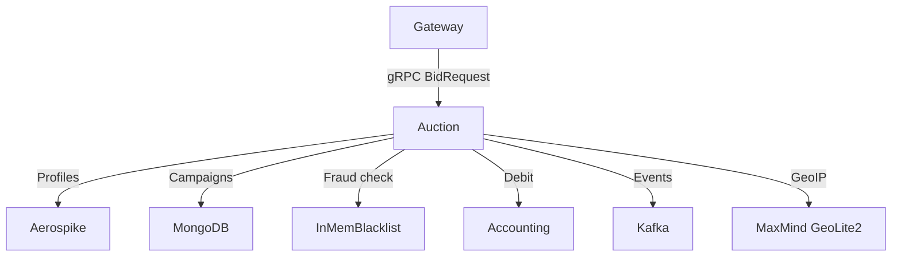
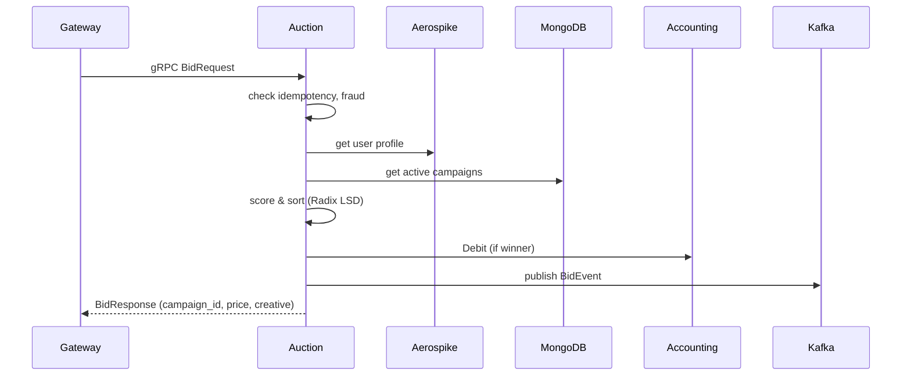
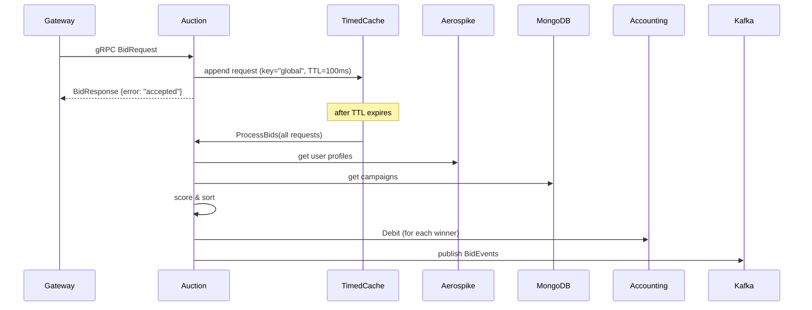

# 🇬🇧 Auction Service / 🇷🇺 Сервис Auction

## 🇬🇧 Overview / 🇷🇺 Обзор

The Auction service is the core of the RTB platform. It receives bid requests, enriches them with user profiles (Aerospike), checks fraud (in‑memory blacklist), evaluates campaign value using machine learning models (LTV, geo‑factor, impression value), sorts bids with LSD Radix Sort (O(N)), determines the winner, debits the budget via Accounting, and publishes events to Kafka. The service supports both synchronous and asynchronous processing modes.
Сервис Auction — ядро RTB‑платформы. Он принимает запросы на ставку, обогащает их профилем пользователя (Aerospike), проверяет фрод (in‑memory чёрный список), оценивает ценность кампаний с помощью ML‑моделей (LTV, гео‑фактор, ценность показа), сортирует ставки LSD Radix Sort (O(N)), определяет победителя, списывает бюджет через Accounting и публикует события в Kafka. Сервис поддерживает как синхронный, так и асинхронный режимы обработки.

## 🇬🇧 Architecture / 🇷🇺 Архитектура

Auction depends on several infrastructure services and libraries to perform its work.
Auction зависит от нескольких инфраструктурных сервисов и библиотек для выполнения своей работы.

## 🇬🇧 Request Flow / 🇷🇺 Поток запроса

### Synchronous mode (when `auctionCache` is nil)

### Asynchronous mode (when `auctionCache` is set)

## 🇬🇧 Internal Structure / 🇷🇺 Внутреннее устройство

### `cmd/main.go`
Initializes configuration, log, metrics, circuit breakers, GeoIP database, sampler, experiments, gRPC clients (Aerospike, MongoDB, Kafka, Accounting), scoring models, and the gRPC server. Creates the asynchronous auction cache (`timedcache`) with a finalizer that calls `ProcessBids`.
Загружает конфигурацию, логер, метрики, circuit breakers, базу GeoIP, сэмплер, эксперименты, gRPC‑клиенты (Aerospike, MongoDB, Kafka, Accounting), модели скоринга и gRPC‑сервер. Создаёт асинхронный кэш аукционов (`timedcache`) с финализатором, который вызывает `ProcessBids`.

### `internal/domain/engine.go`
Pure business logic of the auction: iterates over campaigns, computes effective bid using the scorer, sorts candidates by effective bid (via `sorter.go`), and returns the winner. Also collects statistics (median, percentiles).
Чистая бизнес‑логика аукциона: перебирает кампании, вычисляет эффективную ставку с помощью скорера, сортирует кандидатов по эффективной ставке (через `sorter.go`) и возвращает победителя. Также собирает статистики (медиана, перцентили).

### `internal/domain/sorter.go`
Thin wrapper around `pkg/radixsort` to sort effective bids and synchronously reorder indices.
Тонкая обёртка над `pkg/radixsort` для сортировки эффективных ставок и синхронной перестановки индексов.

### `internal/domain/scoring/`
Defines the `Scorer` interface and its implementation `predictiveScorer`. The scorer combines LTV prediction, impression value, and geo‑factor to compute an overall score and optimal bid.
Определяет интерфейс `Scorer` и его реализацию `predictiveScorer`. Скорер объединяет прогноз LTV, ценность показа и гео‑фактор для вычисления общего скора и оптимальной ставки.

### `internal/ports/interfaces.go`
Interfaces for `UserProfileRepo`, `CampaignRepo`, `FraudDetector`, `GeoResolver`, `EventPublisher`, `AccountingPort`.
Интерфейсы для `UserProfileRepo`, `CampaignRepo`, `FraudDetector`, `GeoResolver`, `EventPublisher`, `AccountingPort`.

### `internal/adapters/`
- **aerospike** – real Aerospike client for user profiles.
- **mongodb** – loads campaigns from MongoDB and caches them with `timedcache`.
- **fraud** – in‑memory blacklist (IP/deviceID) with RWMutex.
- **geodata** – resolves billboard coordinates from in‑memory map.
- **kafka** – Kafka producer that sends `BidEvent` in JSON.
- **grpcclient** – Accounting gRPC client adapter.

### `internal/server/grpc.go`
Implements the `AuctionService` gRPC server. Contains both the synchronous `Bid` method and the asynchronous `ProcessBids`/`processBid` methods. Handles idempotency, fraud, GeoIP, device parsing, A/B experiment selection, and calls the domain engine.
Реализует gRPC‑сервер `AuctionService`. Содержит как синхронный метод `Bid`, так и асинхронные `ProcessBids`/`processBid`. Обрабатывает идемпотентность, фрод, GeoIP, парсинг устройства, выбор A/B‑эксперимента и вызывает доменный движок.

## 🇬🇧 Used Shared Packages / 🇷🇺 Используемые общие пакеты

| Package | Purpose |
|---------|---------|
| `config` | Load YAML and override with environment variables |
| `logger` | Structured logging with `slog` |
| `metrics` | OpenTelemetry counters and histograms |
| `shutdown` | Graceful stop with priorities and timeouts |
| `fixedpoint` | Exact monetary arithmetic (int64 kopeks) |
| `geospatial` | Haversine distance, point‑in‑polygon |
| `valuation` | LTV model, impression value, geo factor, win‑rate optimiser |
| `radixsort` | LSD Radix Sort for int64, with index tracking |
| `idempotent` | Idempotency key store |
| `timedcache` | TTL cache with configurable finalizer (used for async auction and campaign cache) |
| `breaker` | Circuit breaker for Aerospike, MongoDB, and external calls |
| `device` | Zero‑allocation User‑Agent parser |
| `geoip` | MaxMind GeoLite2 in‑memory lookup |
| `sampler` | Probabilistic event sampling |
| `experiment` | Deterministic A/B experiment flags |
| `statistics` | Median, percentiles for monitoring |

## 🇬🇧 Configuration / 🇷🇺 Конфигурация

Auction is configured via YAML (`configs/dev.yaml`) and environment variables with the `RTB_` prefix.
Auction настраивается через YAML (`configs/dev.yaml`) и переменные окружения с префиксом `RTB_`.

Key settings:
- `server.port` / `SERVER_PORT` – gRPC port (default `9001`)
- `aerospike.hosts` / `AEROSPIKE_HOSTS` – Aerospike node addresses
- `mongo.uri` / `MONGO_URI` – MongoDB connection string
- `mongo.db` / `MONGO_DB` – MongoDB database name
- `grpc.accounting` / `GRPC_ACCOUNTING` – Accounting gRPC address
- `scoring.ltv_coeffs` / `SCORING_LTVCOEFFS` – coefficients for LTV model
- `scoring.ctr` / `SCORING_CTR` – base click‑through rate
- `scoring.cvr` / `SCORING_CVR` – base conversion rate
- `scoring.base_conversion_value` / `SCORING_BASECONVERSIONVALUE` – value of one conversion (in kopeks)
- `scoring.geo_decay` / `SCORING_GEODECAY` – geo factor decay rate
- `fraud.blacklist` / `FRAUD_BLACKLIST` – initial list of blocked IPs/deviceIDs
- `kafka.brokers` / `KAFKA_BROKERS` – Kafka broker list
- `kafka.topic` / `KAFKA_TOPIC` – topic for bid events
- `experiments.flags` / `EXPERIMENTS_FLAGS` – A/B experiment percentages
- `sampler.rate` / `SAMPLER_RATE` – event sampling rate
- `breaker.*` – thresholds and timeouts for circuit breakers
- `geoip.database_path` / `GEOIP_DATABASEPATH` – path to GeoLite2 mmdb file (optional)