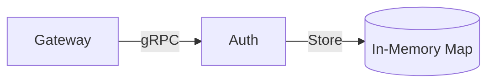
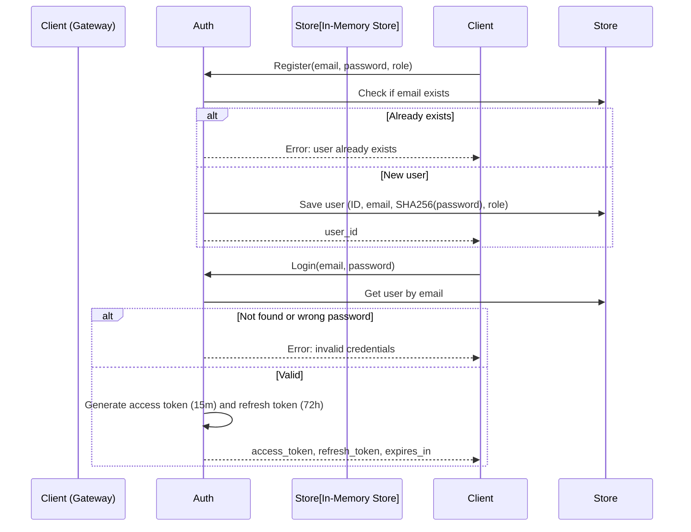
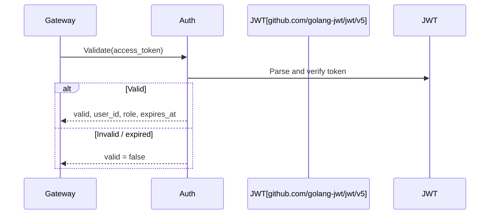
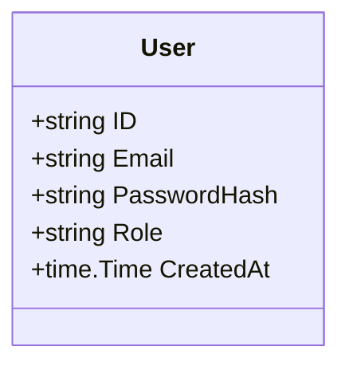

# 🇬🇧 Auth Service / 🇷🇺 Сервис Auth

## 🇬🇧 Overview / 🇷🇺 Обзор

The Auth service manages user accounts, issues JWT access and refresh tokens, and validates tokens for protected endpoints. It uses in‑memory storage (with plans to migrate to PostgreSQL) and SHA‑256 password hashing (bcrypt is recommended for production).
Сервис Auth управляет учётными записями пользователей, выпускает JWT access‑ и refresh‑токены и проверяет их для защищённых эндпоинтов. Используется in‑memory хранилище (с планами на миграцию в PostgreSQL) и хеширование паролей SHA‑256 (для production рекомендуется bcrypt).

## 🇬🇧 Architecture / 🇷🇺 Архитектура



Gateway calls Auth for user registration, login, and token validation. The service does not depend on any external databases in the current implementation.
Gateway обращается к Auth для регистрации пользователей, входа и проверки токенов. В текущей реализации сервис не зависит от внешних баз данных.

## 🇬🇧 Request Flow / 🇷🇺 Поток запроса

### Register and Login



### Validate Token



## 🇬🇧 Internal Structure / 🇷🇺 Внутреннее устройство

### `cmd/main.go`
Loads configuration, creates the in‑memory user store, inserts a default admin account, and starts the gRPC server.
Загружает конфигурацию, создаёт in‑memory хранилище пользователей, добавляет учётную запись администратора по умолчанию и запускает gRPC‑сервер.

### `internal/domain/user.go`
Defines the `User` struct and the `UserStore` interface (`Create`, `GetByEmail`). The in‑memory implementation uses a map protected by `sync.RWMutex`.
Определяет структуру `User` и интерфейс `UserStore` (`Create`, `GetByEmail`). In‑memory реализация использует map, защищённый `sync.RWMutex`.

### `internal/server/grpc.go`
Implements `AuthServiceServer`. Contains all RPC handlers: `Register`, `Login`, `Validate`, and a simplified `Refresh`. Token generation uses `golang-jwt/jwt/v5` with HS256 signing and a configurable secret.
Реализует `AuthServiceServer`. Содержит все RPC‑обработчики: `Register`, `Login`, `Validate` и упрощённый `Refresh`. Генерация токенов использует `golang-jwt/jwt/v5` с подписью HS256 и настраиваемым секретом.

## 🇬🇧 Used Shared Packages / 🇷🇺 Используемые общие пакеты

| Package | Purpose |
|---------|---------|
| `config` | Load YAML and override with environment variables |
| `logger` | Structured logging with `slog` |
| `metrics` | OpenTelemetry counters and histograms |
| `shutdown` | Graceful stop with priorities and timeouts |

## 🇬🇧 Configuration / 🇷🇺 Конфигурация

Auth is configured via YAML (`configs/dev.yaml`) and environment variables with the `RTB_` prefix.
Auth настраивается через YAML (`configs/dev.yaml`) и переменные окружения с префиксом `RTB_`.

Key settings:
- `server.port` / `SERVER_PORT` – gRPC port (default `9004`)
- `jwt.secret` / `JWT_SECRET` – secret key for HMAC‑SHA256 signing
- `jwt.access_ttl` / `JWT_ACCESS_TTL` – access token lifetime (e.g. `15m`)
- `jwt.refresh_ttl` / `JWT_REFRESH_TTL` – refresh token lifetime (e.g. `72h`)

## 🇬🇧 Data Model / 🇷🇺 Модель данных

The service does not use a database yet, but the `User` struct defines the stored fields:
Сервис пока не использует базу данных, но структура `User` определяет сохраняемые поля:



- **ID** – unique identifier generated at registration.
- **Email** – used as login and unique key.
- **PasswordHash** – hexadecimal SHA‑256 hash of the password.
- **Role** – for future role‑based access control (`admin`, `advertiser`, `analyst`).
- **CreatedAt** – timestamp of account creation.

In the in‑memory store, the map key is the email. A default administrator (`admin@rtb-platform.local`) is created at startup if the store is empty.
В in‑memory хранилище ключом является email. Администратор по умолчанию (`admin@rtb-platform.local`) создаётся при запуске, если хранилище пусто.

## 🇬🇧 Security Considerations / 🇷🇺 Аспекты безопасности

- **Password hashing** currently uses SHA‑256 for simplicity. It is strongly recommended to replace it with bcrypt or argon2 before production use.
- **JWT secret** should be a long, random string and must be kept confidential.
- **Refresh token invalidation** is not yet implemented – a token blacklist or versioning should be added for production.
- **Role‑based access** is partially prepared (roles are stored and included in tokens) but not enforced yet.

---

- **Хеширование паролей** пока использует SHA‑256 для простоты. Настоятельно рекомендуется заменить его на bcrypt или argon2 перед использованием в production.
- **Секрет JWT** должен быть длинной случайной строкой и храниться в секрете.
- **Инвалидация refresh‑токенов** ещё не реализована – для production следует добавить чёрный список или версионирование.
- **Ролевой доступ** частично подготовлен (роли сохраняются и включаются в токены), но пока не применяется.
``````markdown
# 🇬🇧 Auth Service / 🇷🇺 Сервис Auth

## 🇬🇧 Overview / 🇷🇺 Обзор

The Auth service manages user accounts, issues JWT access and refresh tokens, and validates tokens for protected endpoints. It uses in‑memory storage (with plans to migrate to PostgreSQL) and SHA‑256 password hashing (bcrypt is recommended for production).
Сервис Auth управляет учётными записями пользователей, выпускает JWT access‑ и refresh‑токены и проверяет их для защищённых эндпоинтов. Используется in‑memory хранилище (с планами на миграцию в PostgreSQL) и хеширование паролей SHA‑256 (для production рекомендуется bcrypt).

## 🇬🇧 Architecture / 🇷🇺 Архитектура


Gateway calls Auth for user registration, login, and token validation. The service does not depend on any external databases in the current implementation.
Gateway обращается к Auth для регистрации пользователей, входа и проверки токенов. В текущей реализации сервис не зависит от внешних баз данных.

## 🇬🇧 Request Flow / 🇷🇺 Поток запроса

### Register and Login


### Validate Token


## 🇬🇧 Internal Structure / 🇷🇺 Внутреннее устройство

### `cmd/main.go`
Loads configuration, creates the in‑memory user store, inserts a default admin account, and starts the gRPC server.
Загружает конфигурацию, создаёт in‑memory хранилище пользователей, добавляет учётную запись администратора по умолчанию и запускает gRPC‑сервер.

### `internal/domain/user.go`
Defines the `User` struct and the `UserStore` interface (`Create`, `GetByEmail`). The in‑memory implementation uses a map protected by `sync.RWMutex`.
Определяет структуру `User` и интерфейс `UserStore` (`Create`, `GetByEmail`). In‑memory реализация использует map, защищённый `sync.RWMutex`.

### `internal/server/grpc.go`
Implements `AuthServiceServer`. Contains all RPC handlers: `Register`, `Login`, `Validate`, and a simplified `Refresh`. Token generation uses `golang-jwt/jwt/v5` with HS256 signing and a configurable secret.
Реализует `AuthServiceServer`. Содержит все RPC‑обработчики: `Register`, `Login`, `Validate` и упрощённый `Refresh`. Генерация токенов использует `golang-jwt/jwt/v5` с подписью HS256 и настраиваемым секретом.

## 🇬🇧 Used Shared Packages / 🇷🇺 Используемые общие пакеты

| Package | Purpose |
|---------|---------|
| `config` | Load YAML and override with environment variables |
| `logger` | Structured logging with `slog` |
| `metrics` | OpenTelemetry counters and histograms |
| `shutdown` | Graceful stop with priorities and timeouts |

## 🇬🇧 Configuration / 🇷🇺 Конфигурация

Auth is configured via YAML (`configs/dev.yaml`) and environment variables with the `RTB_` prefix.
Auth настраивается через YAML (`configs/dev.yaml`) и переменные окружения с префиксом `RTB_`.

Key settings:
- `server.port` / `SERVER_PORT` – gRPC port (default `9004`)
- `jwt.secret` / `JWT_SECRET` – secret key for HMAC‑SHA256 signing
- `jwt.access_ttl` / `JWT_ACCESS_TTL` – access token lifetime (e.g. `15m`)
- `jwt.refresh_ttl` / `JWT_REFRESH_TTL` – refresh token lifetime (e.g. `72h`)

## 🇬🇧 Data Model / 🇷🇺 Модель данных

The service does not use a database yet, but the `User` struct defines the stored fields:
Сервис пока не использует базу данных, но структура `User` определяет сохраняемые поля:


- **ID** – unique identifier generated at registration.
- **Email** – used as login and unique key.
- **PasswordHash** – hexadecimal SHA‑256 hash of the password.
- **Role** – for future role‑based access control (`admin`, `advertiser`, `analyst`).
- **CreatedAt** – timestamp of account creation.

In the in‑memory store, the map key is the email. A default administrator (`admin@rtb-platform.local`) is created at startup if the store is empty.
В in‑memory хранилище ключом является email. Администратор по умолчанию (`admin@rtb-platform.local`) создаётся при запуске, если хранилище пусто.

## 🇬🇧 Security Considerations / 🇷🇺 Аспекты безопасности

- **Password hashing** currently uses SHA‑256 for simplicity. It is strongly recommended to replace it with bcrypt or argon2 before production use.
- **JWT secret** should be a long, random string and must be kept confidential.
- **Refresh token invalidation** is not yet implemented – a token blacklist or versioning should be added for production.
- **Role‑based access** is partially prepared (roles are stored and included in tokens) but not enforced yet.

---

- **Хеширование паролей** пока использует SHA‑256 для простоты. Настоятельно рекомендуется заменить его на bcrypt или argon2 перед использованием в production.
- **Секрет JWT** должен быть длинной случайной строкой и храниться в секрете.
- **Инвалидация refresh‑токенов** ещё не реализована – для production следует добавить чёрный список или версионирование.
- **Ролевой доступ** частично подготовлен (роли сохраняются и включаются в токены), но пока не применяется.