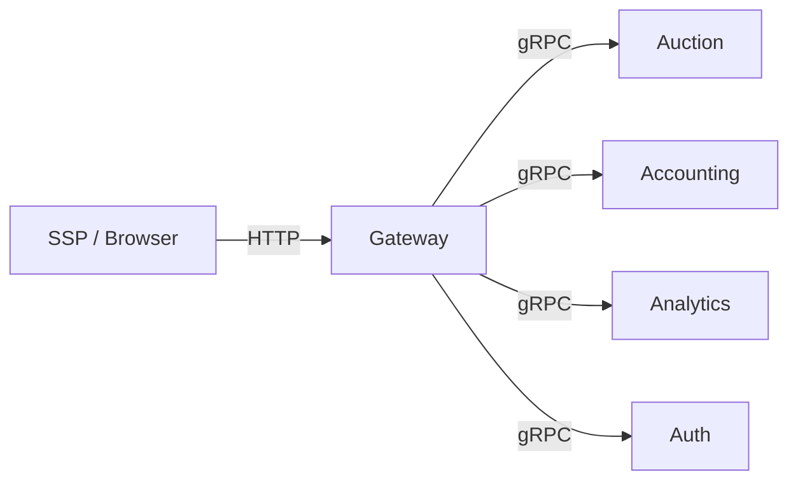
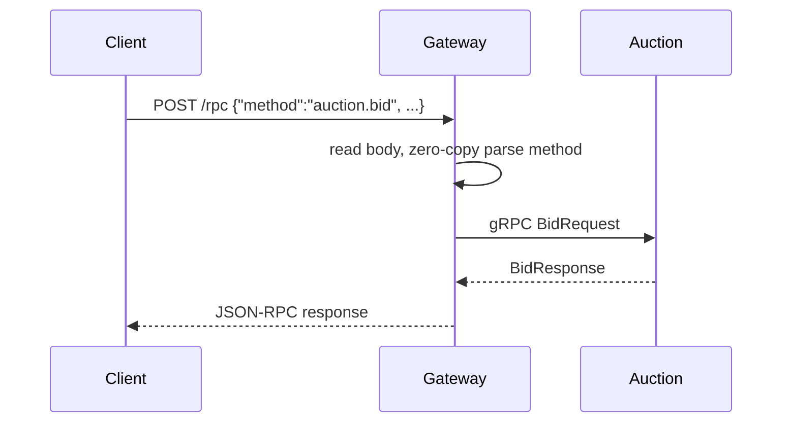
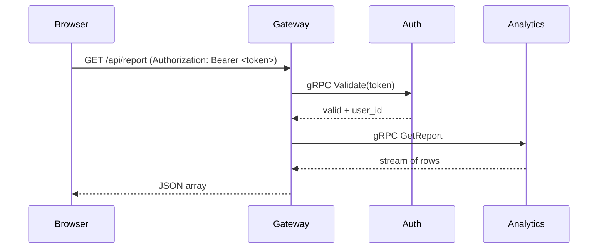

# 🇬🇧 Gateway Service / 🇷🇺 Сервис Gateway

## 🇬🇧 Overview / 🇷🇺 Обзор

Gateway is the single entry point for all external clients (SSP, web dashboard). It translates JSON‑RPC calls into gRPC requests, serves the SPA dashboard, enforces rate limits and idempotency, and performs JWT authentication.
Gateway — единая точка входа для всех внешних клиентов (SSP, веб-дашборд). Он преобразует JSON‑RPC вызовы в gRPC запросы, раздаёт SPA-дашборд, контролирует частоту запросов, гарантирует идемпотентность и выполняет JWT‑аутентификацию.

## 🇬🇧 Architecture / 🇷🇺 Архитектура

The Gateway forwards every request to the appropriate backend service through gRPC, never touching business logic directly.
Gateway пересылает каждый запрос соответствующему внутреннему сервису через gRPC, не занимаясь бизнес‑логикой напрямую.

## 🇬🇧 Key Capabilities / 🇷🇺 Ключевые возможности

- **JSON‑RPC 2.0** – methods `auction.bid`, `accounting.debit`, `accounting.getBalance`, `auth.register`, `auth.login`.
- **REST API** – `GET /api/report`, `GET /api/forecast`, `GET /api/factor-analysis` (require JWT).
- **Excel export** – `GET /export/report` returns an `.xlsx` file.
- **Static files** – serves the React dashboard from `web/dist` with SPA fallback.
- **Middleware chain** – rate limiting, idempotency, appsec (host allowlist), optional JWT authentication.
- **CORS** – open headers for browser clients.

## 🇬🇧 Request Flow / 🇷🇺 Поток запроса

### JSON‑RPC (synchronous example)

1. The HTTP handler reads the body into a reusable buffer (`zerocopy`).
2. It extracts `method`, `params` and `id` without allocating strings.
3. The method is dispatched through a type‑safe registry (`pkg/registry`) to the corresponding gRPC port.
4. The response is serialised into JSON‑RPC and written back.

### Protected REST endpoint

---

## 🇬🇧 Internal Structure / 🇷🇺 Внутреннее устройство

### `cmd/main.go`
Initialises configuration, log, metrics, gRPC clients to all backends, middleware, and the HTTP server.  
Загружает конфигурацию, логер, метрики, gRPC‑клиенты ко всем сервисам, промежуточные слои и HTTP‑сервер.

### `internal/domain/jsonrpc.go`
Registers handlers for each JSON‑RPC method using `pkg/registry`. Each handler unmarshals JSON parameters, calls the appropriate gRPC port, and returns a protobuf message.  
Регистрирует обработчики для каждого JSON‑RPC метода через `pkg/registry`. Каждый обработчик разбирает JSON‑параметры, вызывает нужный gRPC‑порт и возвращает protobuf‑сообщение.

### `internal/ports/interfaces.go`
Defines `AuctionPort`, `AccountingPort`, `AnalyticsPort`, `AuthPort` – interfaces that the domain layer expects.  
Определяет интерфейсы `AuctionPort`, `AccountingPort`, `AnalyticsPort`, `AuthPort`, которые нужны доменному слою.

### `internal/adapters/grpcclient/`
Implements the ports by wrapping gRPC clients. Each adapter logs errors and simply forwards the call.  
Реализует порты, оборачивая gRPC‑клиенты. Каждый адаптер логирует ошибки и просто передаёт вызов дальше.

### `internal/handler/analytics.go`
REST handlers for analytics endpoints. They parse query parameters, call the Analytics gRPC port, and write JSON responses.  
REST‑обработчики аналитических эндпоинтов. Разбирают параметры запроса, вызывают gRPC‑порт Analytics и пишут JSON‑ответ.

### `internal/middleware/`
- **auth** – validates JWT via Auth service (disabled in dev by default).  
  Проверяет JWT через сервис Auth (по умолчанию отключён в dev).
- **appsec** – checks the `Host` header against an allowed list.  
  Проверяет заголовок `Host` на соответствие списку разрешённых.
- **ratelimit** – per‑IP rate limiting using `pkg/ratelimit`.  
  Ограничение частоты запросов с одного IP через `pkg/ratelimit`.
- **idempotent** – uses `Idempotency-Key` header to prevent duplicate POST requests.  
  Использует заголовок `Idempotency-Key` для предотвращения дублирования POST‑запросов.

### `internal/server/http.go`
Configures the HTTP server, registers routes, chains middleware, and serves static files with SPA fallback.  
Настраивает HTTP‑сервер, регистрирует маршруты, собирает цепочку middleware и раздаёт статику с SPA‑фолбеком.

---

## 🇬🇧 Used Shared Packages / 🇷🇺 Используемые общие пакеты

| Package | Purpose |
|---------|---------|
| `config` | Load YAML and override with environment variables |
| `logger` | Structured logging with `slog` |
| `metrics` | OpenTelemetry counters and histograms |
| `shutdown` | Graceful stop with priorities and timeouts |
| `zerocopy` | Buffer pool, zero‑copy JSON parsing and writing |
| `registry` | Type‑safe handler dispatch for JSON‑RPC methods |
| `ratelimit` | Token bucket rate limiter |
| `idempotent` | Idempotency key store (backed by `timedcache`) |
| `appsec` | Security helpers (host validation, HTML sanitisation) |
| `backpressure` | (Optional) pipeline pattern for request handling |

---

## 🇬🇧 Configuration / 🇷🇺 Конфигурация

Gateway is configured via YAML (`configs/dev.yaml`) and environment variables with the `RTB_` prefix.  
Gateway настраивается через YAML (`configs/dev.yaml`) и переменные окружения с префиксом `RTB_`.

Key settings:
- `server.port` / `SERVER_PORT` – HTTP port (default `8080`)
- `grpc.auction` / `GRPC_AUCTION` – Auction address
- `grpc.accounting` / `GRPC_ACCOUNTING` – Accounting address
- `grpc.analytics` / `GRPC_ANALYTICS` – Analytics address
- `grpc.auth` / `GRPC_AUTH` – Auth address
- `security.rate_limit` / `SECURITY_RATELIMIT` – max requests per second per IP
- `security.rate_burst` / `SECURITY_RATEBURST` – burst size
- `security.idempotency_ttl` / `SECURITY_IDEMPOTENCYTTL` – idempotency key lifetime

---

## 🇬🇧 Static Files and SPA Fallback / 🇷🇺 Статика и SPA‑фолбек

When `staticDir` is set (`web/dist`), Gateway serves the React dashboard. Any request that does not match `/api`, `/rpc`, `/export` or `/metrics` is mapped to `index.html` if the requested file does not exist. This allows client‑side routing (React Router) to work correctly.  
Когда задана `staticDir` (`web/dist`), Gateway раздаёт React‑дашборд. Любой запрос, не совпадающий с `/api`, `/rpc`, `/export` или `/metrics`, перенаправляется на `index.html`, если запрошенный файл не существует. Это позволяет клиентской маршрутизации (React Router) работать корректно.