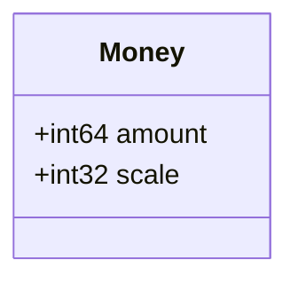
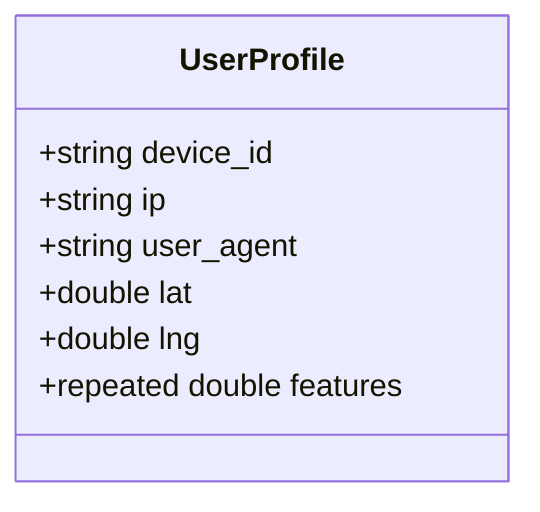
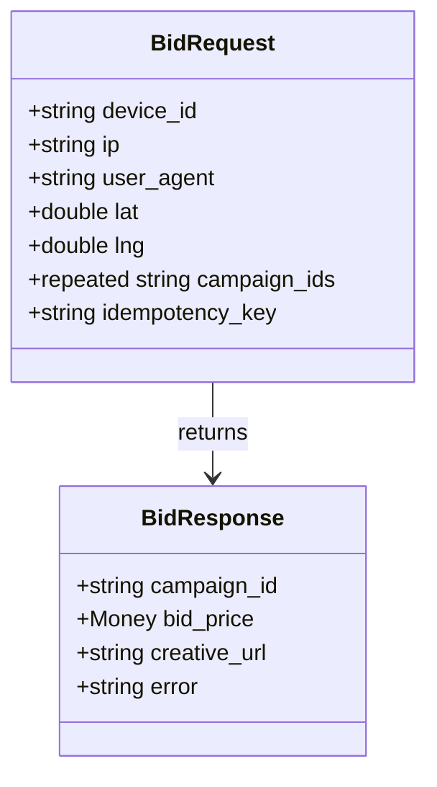
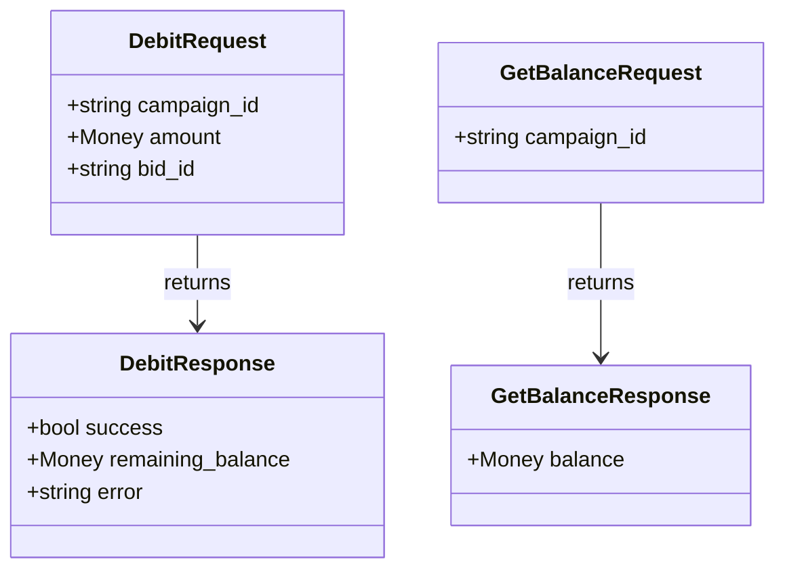
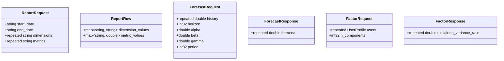
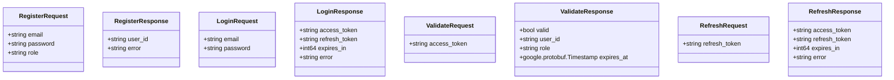
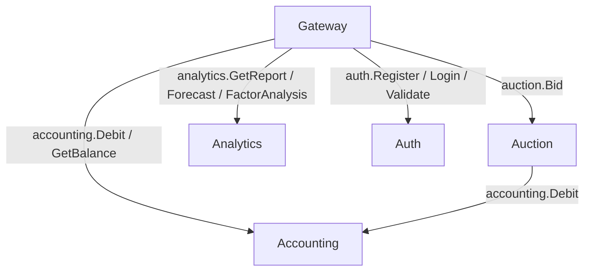

# 🇬🇧 Protocol Buffers Contracts / 🇷🇺 Proto‑контракты

## 🇬🇧 Overview / 🇷🇺 Обзор

All inter‑service communication uses Protocol Buffers (proto3). Contracts are defined in `proto/` and generated code lives in `pb/`. Every service has its own package (`auction.v1`, `accounting.v1`, `analytics.v1`, `auth.v1`) plus shared types in `common.v1`.
Всё межсервисное взаимодействие построено на Protocol Buffers (proto3). Контракты определены в `proto/`, сгенерированный код находится в `pb/`. Каждый сервис имеет свой пакет (`auction.v1`, `accounting.v1`, `analytics.v1`, `auth.v1`) плюс общие типы в `common.v1`.

## 🇬🇧 Shared Types / 🇷🇺 Общие типы (`common/v1/`)

### `money.proto`



Represents a monetary value in minimal units (kopeks, cents). `amount` is the integer value, `scale` is the number of decimal places (usually 2). All financial operations use this type to avoid floating‑point errors.
Представляет денежную сумму в минимальных единицах (копейки, центы). `amount` — целое значение, `scale` — количество знаков после запятой (обычно 2). Все финансовые операции используют этот тип, чтобы избежать ошибок плавающей точки.

### `user.proto`



A user profile used by Auction and Analytics. `features` is a vector of numerical attributes for LTV prediction and clustering.
Профиль пользователя, используемый Auction и Analytics. `features` — вектор числовых признаков для прогнозирования LTV и кластеризации.

---

## 🇬🇧 Auction (`auction/v1/auction.proto`)



- `BidRequest` contains device info, location, and an optional list of campaign IDs to restrict the auction.
- `BidResponse` returns the winner’s campaign ID, the bid price in Money, the creative URL, or an error message (`"accepted"` in async mode, `"fraud"`, `"no suitable campaign"`).

Service definition:

```protobuf
service AuctionService {
  rpc Bid (BidRequest) returns (BidResponse);
}
```

---

## 🇬🇧 Accounting (`accounting/v1/accounting.proto`)



- `DebitRequest.bid_id` is used for idempotency.
- `DebitResponse.error` may contain `"insufficient funds"`.
- `GetBalance` simply returns the current balance.

Service definition:

```protobuf
service AccountingService {
  rpc Debit (DebitRequest) returns (DebitResponse);
  rpc GetBalance (GetBalanceRequest) returns (GetBalanceResponse);
}
```

---

## 🇬🇧 Analytics (`analytics/v1/analytics.proto`)



- `GetReport` streams `ReportRow` messages, one per combination of dimensions.
- `Forecast` uses Holt‑Winters parameters; if not provided, sensible defaults are applied.
- `FactorAnalysis` accepts a set of `UserProfile` objects and returns the explained variance ratio for each principal component.

Service definition:

```protobuf
service AnalyticsService {
  rpc GetReport (ReportRequest) returns (stream ReportRow);
  rpc Forecast (ForecastRequest) returns (ForecastResponse);
  rpc FactorAnalysis (FactorRequest) returns (FactorResponse);
}
```

---

## 🇬🇧 Auth (`auth/v1/auth.proto`)



- `Register` creates a new user.
- `Login` returns an access token (short‑lived) and a refresh token (long‑lived).
- `Validate` checks the access token’s validity and returns associated metadata.
- `Refresh` accepts a refresh token and returns a new pair (simplified implementation).

Service definition:

```protobuf
service AuthService {
  rpc Register (RegisterRequest) returns (RegisterResponse);
  rpc Login (LoginRequest) returns (LoginResponse);
  rpc Validate (ValidateRequest) returns (ValidateResponse);
  rpc Refresh (RefreshRequest) returns (RefreshResponse);
}
```

---

## 🇬🇧 How Contracts Are Used / 🇷🇺 Как используются контракты



- Gateway translates JSON‑RPC and REST calls into the corresponding gRPC methods.
- Auction calls `accounting.Debit` directly after a winner is chosen.
- All services use the generated Go code from `pb/` to ensure type safety.