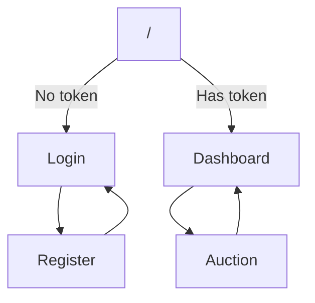

# 🇬🇧 Dashboard SRS / 🇷🇺 Техническое задание на дашборд

## 🇬🇧 Overview / 🇷🇺 Обзор

The Dashboard is a single‑page application (SPA) that provides a visual interface for the RTB platform. It allows users to authenticate, view analytics reports, run demo auctions, and export data. This document defines the functional and non‑functional requirements implemented in the Dashboard.
Дашборд — это одностраничное приложение (SPA), предоставляющее визуальный интерфейс для RTB‑платформы. Он позволяет пользователям аутентифицироваться, просматривать аналитические отчёты, запускать демо‑аукционы и экспортировать данные. Этот документ определяет реализованные функциональные и нефункциональные требования к дашборду.

---

## 🇬🇧 Functional Requirements / 🇷🇺 Функциональные требования

### FR‑DASH‑001: Authentication Pages
**🇬🇧** The dashboard MUST provide a Login page and a Registration page.  
**🇷🇺** Дашборд ДОЛЖЕН предоставлять страницу входа и страницу регистрации.

- **Login**: MUST accept email and password, call `auth.login` via JSON‑RPC, store the returned JWT in `localStorage`, and redirect to the main dashboard.  
  **Вход**: ДОЛЖЕН принимать email и пароль, вызывать `auth.login` через JSON‑RPC, сохранять полученный JWT в `localStorage` и перенаправлять на главную страницу.
- **Register**: MUST accept email and password, call `auth.register`, and redirect to the login page on success.  
  **Регистрация**: ДОЛЖЕН принимать email и пароль, вызывать `auth.register` и перенаправлять на страницу входа при успехе.

### FR‑DASH‑002: Route Protection
**🇬🇧** Pages that require authentication (Dashboard, Auction) MUST be wrapped in a `PrivateRoute` component that checks for the presence of a token in `localStorage`. If no token exists, the user MUST be redirected to `/login`.  
**🇷🇺** Страницы, требующие аутентификации (Dashboard, Auction), ДОЛЖНЫ быть обёрнуты в компонент `PrivateRoute`, который проверяет наличие токена в `localStorage`. Если токен отсутствует, пользователь ДОЛЖЕН быть перенаправлен на `/login`.

### FR‑DASH‑003: Navigation
**🇬🇧** Every authenticated page MUST include a navigation bar with links to Dashboard and Auction.  
**🇷🇺** Каждая аутентифицированная страница ДОЛЖНА содержать панель навигации со ссылками на Dashboard и Auction.

### FR‑DASH‑004: Report Table
**🇬🇧** The Dashboard MUST display an aggregated report table fetched from `GET /api/report`. The table MUST show campaign ID, impressions, clicks, and spend. It MUST show a loading spinner while fetching data.  
**🇷🇺** Дашборд ДОЛЖЕН отображать агрегированную таблицу отчёта, полученную из `GET /api/report`. Таблица ДОЛЖНА показывать ID кампании, показы, клики и расходы. При загрузке данных ДОЛЖЕН отображаться индикатор загрузки.

### FR‑DASH‑005: Forecast Chart
**🇬🇧** The Dashboard MUST render a line chart showing forecast values obtained from `GET /api/forecast`. The chart MUST use Recharts and display a loading spinner until data is available.  
**🇷🇺** Дашборд ДОЛЖЕН отображать линейный график с прогнозными значениями, полученными из `GET /api/forecast`. График ДОЛЖЕН использовать Recharts и показывать индикатор загрузки до получения данных.

### FR‑DASH‑006: Factor Analysis Display
**🇬🇧** The Dashboard MUST show the explained variance ratio for each principal component obtained from `GET /api/factor-analysis`. It MUST display a loading spinner while fetching.  
**🇷🇺** Дашборд ДОЛЖЕН показывать долю объяснённой дисперсии для каждой главной компоненты, полученную из `GET /api/factor-analysis`. При загрузке ДОЛЖЕН отображаться индикатор загрузки.

### FR‑DASH‑007: Excel Export
**🇬🇧** The Dashboard MUST provide a button that opens `GET /export/report` in the browser, triggering a file download.  
**🇷🇺** Дашборд ДОЛЖЕН предоставлять кнопку, которая открывает `GET /export/report` в браузере, вызывая скачивание файла.

### FR‑DASH‑008: Auction Demo Page
**🇬🇧** The Auction page MUST provide a form to enter device ID, IP, latitude, and longitude. On submission, it MUST send a JSON‑RPC `auction.bid` request and display the response in a formatted JSON block.  
**🇷🇺** Страница Auction ДОЛЖНА предоставлять форму для ввода device ID, IP, широты и долготы. При отправке она ДОЛЖНА посылать JSON‑RPC запрос `auction.bid` и отображать ответ в отформатированном JSON‑блоке.

### FR‑DASH‑009: Auth Header Propagation
**🇬🇧** All authenticated API requests MUST include the `Authorization: Bearer <token>` header.  
**🇷🇺** Все аутентифицированные API‑запросы ДОЛЖНЫ содержать заголовок `Authorization: Bearer <token>`.

---

## 🇬🇧 Non‑Functional Requirements / 🇷🇺 Нефункциональные требования

- **NFR‑DASH‑001**: The dashboard MUST be built with React 18, TypeScript, Vite, Tailwind CSS, and Recharts.  
  Дашборд ДОЛЖЕН быть построен с использованием React 18, TypeScript, Vite, Tailwind CSS и Recharts.
- **NFR‑DASH‑002**: API requests MUST be proxied through Vite in development to avoid CORS issues.  
  API‑запросы ДОЛЖНЫ проксироваться через Vite при разработке, чтобы избежать проблем с CORS.
- **NFR‑DASH‑003**: Production build MUST generate static files that are served by Gateway.  
  Production‑сборка ДОЛЖНА генерировать статические файлы, раздаваемые Gateway.
- **NFR‑DASH‑004**: All loading states MUST be indicated to the user (spinners, messages).  
  Все состояния загрузки ДОЛЖНЫ быть обозначены для пользователя (спиннеры, сообщения).
- **NFR‑DASH‑005**: The dashboard MUST be responsive and usable on desktop and tablet screens.  
  Дашборд ДОЛЖЕН быть адаптивным и пригодным для использования на десктопах и планшетах.

---

## 🇬🇧 Page Map / 🇷🇺 Карта страниц

